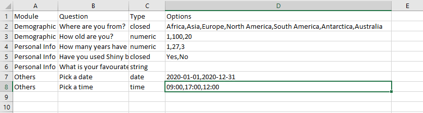

# R Shiny Survey Tool

## Introduction
This is a web app developed with R and Shiny framework. It aims to provide prvide similar functionalities as a google form. You can create your custom surveys with it and save the data as a CSV file.
You can see live version of the app [here](https://shiny.wahidkhan.me/shiny-servey/)

## How to use?
To create a survey you need to create an excel file named `questions.xlsx` with one worksheet named `questions`, which should contain all your questions in a predefined format. Here is a sample:

From the sample above, you can see the worksheet have five column and multiplle rows. Each row stands for one question. The columns are described below:

### Module
Module column tells the app which module the question belongs to. In the app you'll see one sidebar tab of each unique module and the questions belonging to that module will be arranged in that tab.

### Question
Question column contains the actual question you want to ask.

### Type
This column is used to identify what type of question it is. The app provides different ways to answer a question depending on different types. Currently the app supports five types of question:

* closed: the type `closed` represents multiple choice questions.
* numeric: the type `numeric` is used when you want the answer as a numeric value.
* string: `string` type is used when you want the answer as word or sentence.
* date: `date` type let's the user pick a date.
* time: `time` type let's the user pick a time in 12 hours format.

### Options
This column is used to specify different options for input types. What options you can specify depends on the `type`. 

* closed: for `closed` type you need to provide all the choices separated by commas. For `closed` types this field is required.
* numeric: for `numeric` type options field is optional. You can specify lower bound, upeer bound and default value separated by commas in that specific order. You don't have to specify all three of them. For example, you can put `,60,` to only specify the upper bound. You can leave it blank to specify none of them.
* string: `string` type questions don't have any options
* date: for `date` type you can optinally specify a lower and an upper bound. The dates have to be in `yyyy-mm-dd` format.
* time: for `time` types you can optionally specify the lower bound, the upper bound and the default value, separated by commas and that specific order. The times have to be in 24 hrs `HH:MM` format.

## Bugs

* The time input doesn't work properly. Would love your help to fix it.

## Future plans

* Add option to download the submitted answer by clicking a button.
* Add more types